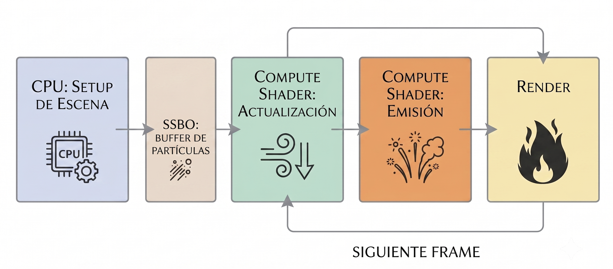

# Simulación de Fuego Basada en Partículas con Curl Noise en GPU

Este proyecto es una simulación de fuego hecha con partículas que corre casi por completo en la tarjeta gráfica (GPU), usando Compute Shaders de OpenGL. El movimiento turbulento de las llamas, el humo y las cenizas se genera con **Curl Noise**, una técnica que imita el comportamiento del aire caliente sin el costo de resolver las ecuaciones completas de fluidos. La simulación además entiende de materiales: el papel se quema rápido, la madera arde lento y el cemento prácticamente no se quema.

---

## Resultados

La escena principal del proyecto es **Test5**: una hoja de papel sobre fondo blanco que se enciende por una esquina y se consume por completo a lo largo de 28 segundos. El fuego avanza en diagonal con bordes dentados y agujeros irregulares, tal como se quema una hoja de verdad.

<!-- Captura del inicio del fuego (primeros segundos, cuando la esquina recién se enciende). Guardar como docs/test5_inicio.png -->


<!-- Captura del punto más alto del fuego (frente de llamas avanzando en diagonal sobre la hoja). Guardar como docs/test5_pico.png -->


Esta escena se ejecuta con:

```cmd
build\Release\FireSimulation.exe --scene Test5 --preview --lightweight
```

---

## Pipeline de la simulación

<!--
INSTRUCCIONES PARA GENERAR LA IMAGEN DEL PIPELINE (pegar este prompt en Gemini):

"Genera un diagrama de pipeline horizontal, limpio y profesional, para un README técnico.
Título del diagrama: 'Pipeline de la Simulación de Fuego en GPU'.
Debe tener 4 bloques conectados por flechas de izquierda a derecha:
1) Bloque 'CPU: Setup de Escena' (subtexto: 'genera partículas del material y tiempos de ignición, sube datos al SSBO') — este bloque de un color distinto (gris azulado) para indicar que ocurre solo una vez.
2) Bloque 'Compute Shader: Actualización' (subtexto: 'curl noise + flotabilidad + gravedad + fases de combustión').
3) Bloque 'Compute Shader: Emisión' (subtexto: 'recicla partículas muertas como fuego, humo y chispas').
4) Bloque 'Render' (subtexto: 'vertex lee SSBO → geometry crea billboards → fragment dibuja llamas → blending').
Entre el bloque 1 y los demás, dibujar un cilindro etiquetado 'SSBO: buffer de partículas en GPU' del que salen y entran flechas hacia los bloques 2, 3 y 4.
Agregar una flecha de retorno desde el bloque 4 hacia el bloque 2 etiquetada 'siguiente frame'.
Estilo: fondo blanco, bloques con esquinas redondeadas, paleta sobria con acentos naranja/rojo (tema fuego), texto en español, sin decoraciones innecesarias. Formato apaisado (16:9)."

Guardar la imagen generada como docs/pipeline.png (crear la carpeta docs/ si no existe).
-->



Cada frame de la simulación sigue este recorrido:

1. **CPU – Preparación de la escena (solo una vez)**: la escena genera las partículas de los materiales (por ejemplo, la hoja de papel), calcula los tiempos de ignición y sube todo al buffer de la GPU.
2. **GPU – Compute shader de actualización**: mueve cada partícula aplicando flotabilidad (el aire caliente sube), Curl Noise (turbulencia), viento y gravedad; además avanza las fases de combustión de los materiales y transforma partículas (fuego que se enfría pasa a humo, papel quemado pasa a ceniza).
3. **GPU – Compute shader de emisión**: los emisores buscan partículas muertas en el buffer y las reviven como fuego, humo o chispas nuevas.
4. **GPU – Render**: el vertex shader lee las partículas directamente del buffer, el geometry shader las convierte en billboards orientados a la cámara y el fragment shader pinta la forma de cada llama, humo o ceniza. Finalmente el blending mezcla todo en la imagen final.

El proyecto también incluye un módulo de post-procesado (HDR + bloom, para que las zonas brillantes "irradien" luz), desarrollado durante el proceso, aunque el render final de las escenas usa el camino directo por estabilidad.

---

## Integrantes del Equipo

|    Jean Pierre Sotomayor    |    Leandro Machaca    |     Angel Mucha    |    Yacira Nicol    |
| ----------- | ----------- | ----------- | ----------- |
|  |  |  |  |
| [github.com/JeanPierre](https://github.com/Jeanpierrre) | [github.com/JLeandroJM](https://github.com/JLeandroJM) | [github.com/AngelMucha](https://github.com/AngelMucha) | [github.com/YaciraNicol](https://github.com/YaciraNicol) |

---

## ¿Cómo funciona? (parte por parte)

### 1. Las partículas

Todo en la escena está hecho de partículas: tanto el fuego, el humo y las cenizas, como los objetos sólidos (una hoja de papel, una mesa, una pared). Cada partícula guarda su posición, velocidad, color, tamaño, temperatura y un "tipo" que dice qué es (fuego, humo, ceniza, chispa, papel, madera, cemento, etc.).

Todas las partículas viven en un buffer gigante dentro de la memoria de la GPU (un SSBO, *Shader Storage Buffer Object*). Esto es clave: como los datos nunca salen de la tarjeta gráfica, podemos actualizar cientos de miles de partículas cada frame sin que el procesador (CPU) se convierta en un cuello de botella.

### 2. El movimiento: Curl Noise

El fuego real no sube en línea recta, se retuerce y forma remolinos. Para lograr eso, generamos un campo de ruido (Simplex Noise) y le aplicamos el operador rotacional (curl). El resultado es un campo de velocidades que tiene una propiedad matemática muy útil: su divergencia es cero.

En términos simples: las partículas que siguen este campo **nunca se amontonan en un punto ni se dispersan artificialmente**, que es exactamente cómo se comporta un fluido incompresible como el aire. Por eso el fuego se ve "líquido" y orgánico.

La versión matemática: sea $\vec{\Psi}(x,y,z)$ un campo de potencial generado con funciones de ruido. El campo de velocidades se obtiene como:

$$ \vec{v} = \nabla \times \vec{\Psi} $$

Y como la divergencia de un rotacional siempre es cero ($\nabla \cdot (\nabla \times \vec{\Psi}) = 0$), el campo cumple la ecuación de continuidad de un fluido incompresible ($\nabla \cdot \vec{v} = 0$). Las derivadas se calculan con diferencias finitas centrales:

$$ \frac{\partial \psi}{\partial x} \approx \frac{\psi(x + \epsilon) - \psi(x - \epsilon)}{2\epsilon} $$

Para darle más detalle al movimiento, sumamos varias "octavas" de ruido (capas de turbulencia cada vez más finas), y cada escena puede ajustar la frecuencia, amplitud y velocidad de evolución del ruido según el tipo de fuego que quiera mostrar.

### 3. La combustión de los materiales

Cada partícula de material (por ejemplo, del papel) tiene asignado un **tiempo de ignición**: el momento exacto de la simulación en el que empezará a quemarse. Ese tiempo se calcula al cargar la escena, según la distancia de la partícula al punto donde inicia el fuego, más un poco de ruido para que el avance no sea un círculo perfecto (en papel real hay zonas más húmedas o gruesas que resisten más, y zonas frágiles que se queman casi al instante y forman agujeros dentados).

Cuando a una partícula le llega su momento, pasa por una secuencia de fases, igual que el papel de verdad:

1. **Secado**: el papel se torna amarillento antes de encenderse.
2. **Llama viva**: la partícula brilla con tonos blancos, ámbar y naranjas, con parpadeo (flicker) para simular las lenguas de fuego.
3. **Carbonizado**: el color pasa a marrón oscuro y negro, con brasas rojas que pulsan.
4. **Ceniza**: la partícula se vuelve gris, pierde opacidad y se va desmoronando.
5. **Desintegración**: una parte de las partículas se desprende y flota como ceniza en el aire; el resto simplemente desaparece.

Todo este ciclo ocurre dentro de un compute shader, es decir, la GPU decide el destino de cada partícula en paralelo.

### 4. Los emisores

Además del fuego que nace del propio material, las escenas pueden definir **emisores**: fuentes que generan partículas nuevas de fuego, humo o chispas de forma continua. Un emisor puede tener forma de punto, disco, línea, rectángulo o esfera, y se configura con cuántas partículas por segundo emite, con qué velocidad salen y cuánto viven. Los emisores reciclan partículas "muertas" del buffer, así nunca reservamos memoria nueva durante la simulación.

### 5. El dibujado

Cada partícula se dibuja como un pequeño rectángulo que siempre mira a la cámara (un *billboard*). Un geometry shader se encarga de convertir cada punto en ese rectángulo, y el fragment shader le da la forma final: las llamas se dibujan como lenguas de fuego con bordes irregulares (no como círculos), el humo como manchas suaves y translúcidas, y los materiales como una superficie continua. Con la mezcla de transparencias (blending), miles de partículas superpuestas se funden en una sola masa de fuego.

### 6. La escena principal en detalle (Test5)

En Test5 la hoja de papel está formada por decenas de miles de partículas diminutas (87 500 en modo ligero) que juntas forman una superficie sólida. El fuego avanza en diagonal desde la esquina de ignición, pero no como un frente perfecto: el ruido en los tiempos de ignición crea zonas que resisten más, agujeros que se abren de golpe y bordes dentados. Las llamas nacen de las propias partículas del papel que están en combustión, por lo que el fuego "viaja" junto con el frente de quemado, dejando detrás el papel carbonizado que se deshace en ceniza.

---

## Requisitos

- **Sistema operativo**: Windows.
- **GPU**: NVIDIA con soporte de OpenGL 4.3 o superior (necesario para los Compute Shaders). El proyecto fue desarrollado y probado en una **NVIDIA RTX 3060**; el modo `--lightweight` permite correrlo también en GPUs de gama de entrada como la **GTX 1650**.
- **Herramientas**: CMake (3.16 o superior) y Visual Studio con soporte para C++17.
- **Dependencias**: GLFW (se descarga automáticamente con CMake), GLAD y GLM (incluidas en la carpeta `external/`). OpenCV es opcional y solo se usa para exportar video.

> Nota: el proyecto no corre en macOS, ya que Apple no soporta OpenGL 4.3 ni Compute Shaders.

---

## Compilación

Desde la raíz del proyecto, en una terminal de Windows:

```cmd
cmake -B build
cmake --build build --config Release
```

El ejecutable queda en `build\Release\FireSimulation.exe` y los shaders se copian automáticamente junto a él.

---

## Cómo ejecutar

La escena principal del proyecto se corre con:

```cmd
build\Release\FireSimulation.exe --scene Test5 --preview --lightweight
```

### Opciones disponibles

| Opción | Descripción |
|---|---|
| `--scene <nombre o número>` | Selecciona la escena a ejecutar (ver lista abajo). |
| `--preview` | Abre una ventana de 1280x720 (sin esta opción usa 1920x1080). |
| `--lightweight` | Reduce la cantidad de partículas para GPUs menos potentes. |
| `--export` | Exporta la escena como frames PNG (y video si OpenCV está disponible). |
| `--help` | Muestra la ayuda con todas las opciones. |

### Escenas

| Número | Nombre | Descripción |
|---|---|---|
| 0 | `PaperFire` | Hoja de papel sobre un escritorio de madera que se quema desde una esquina. |
| 1 | `WallFire` | Pared de fuego que sube desde una línea en el suelo. |
| 2 | Objeto ardiendo | Plano vertical de papel que se consume desde el centro. |
| 3 | Explosión | Estallido esférico de partículas de alta velocidad. |
| 4 | Tormenta de fuego | Dos columnas de fuego con viento y alta turbulencia. |
| 5 | `Test5` | **Escena principal**: hoja de papel sobre fondo blanco que se consume por completo. |
| 6 | Test6 | Barco de origami que se quema desde la proa. |

Durante la ejecución, la tecla `ESC` cierra la ventana. La consola muestra los FPS y el tiempo de simulación en todo momento.

---

## Referencias

- Bridson, R., Hourihan, J., & Marcus, M. (2007). *Curl-noise for procedural fluid flow*. ACM SIGGRAPH 2007. https://doi.org/10.1145/1281500.1281671
- Perlin, K. (2002). *Improving Noise*. ACM Trans. Graph., 21(3), 681–682.
- McGuire, M. (s.f.). *Implementación de Simplex Noise de Ashima Arts / Stefan Gustavson* (licencia MIT), usada como base para el ruido en GPU.
