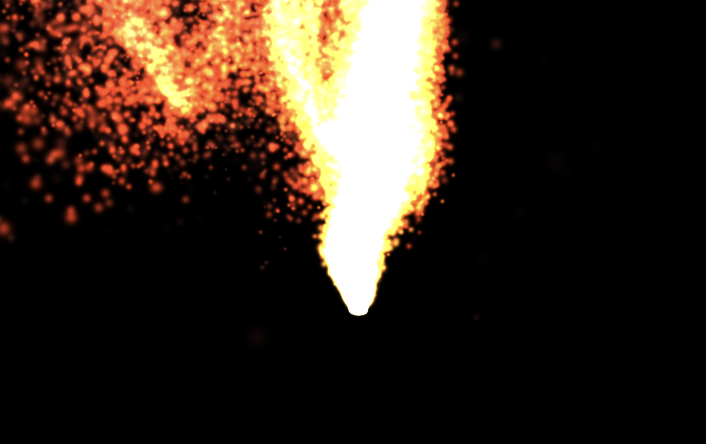
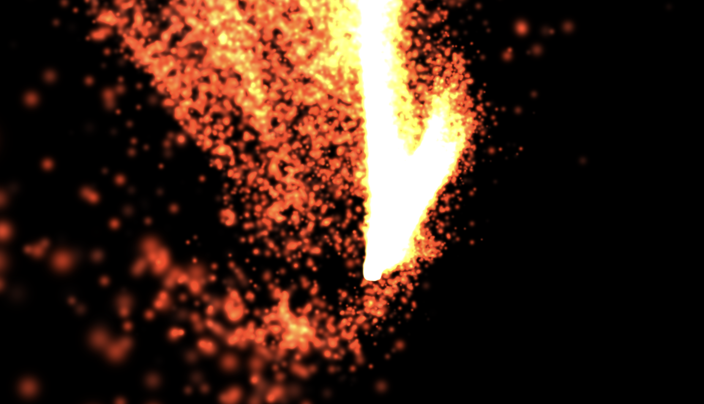
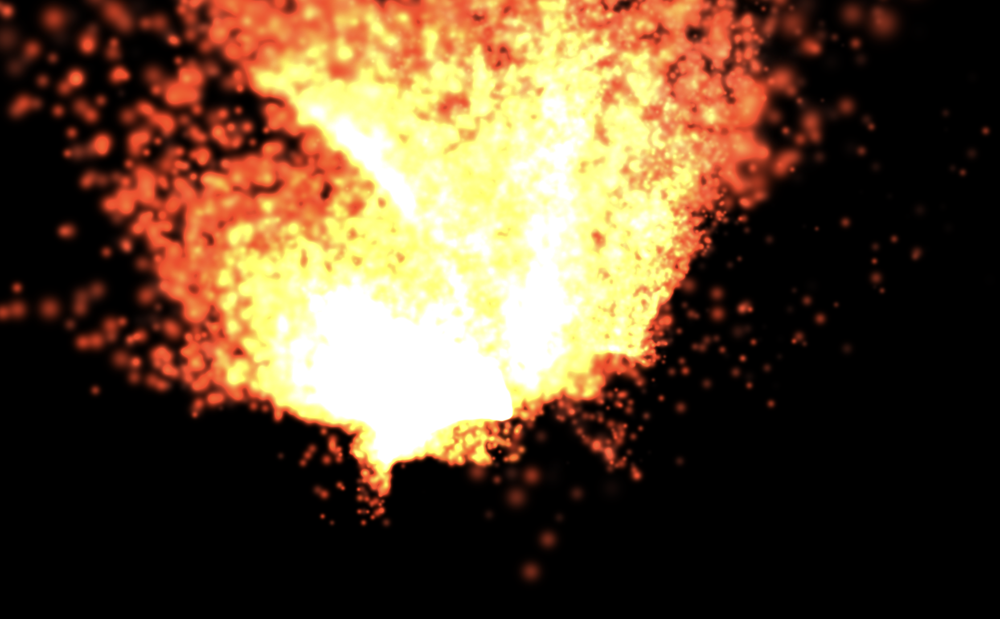

# Curl_Noise_Fire

Simulación de fuego en tiempo real con un sistema de partículas movido por
**curl noise** (Bridson et al., 2007) y la metodología clásica de
particle systems (Reeves, 1983). Implementación nativa en **Metal** sobre
Apple Silicon (M2), con todo el código host escrito en **C++17 puro**
usando los bindings [`metal-cpp`](https://developer.apple.com/metal/cpp/).

Proyecto del curso de Computación Gráfica — UTEC.



## Resumen técnico

- **GPU API:** Metal (compute + render pipelines), sin OpenGL, sin MPS.
- **Host:** C++17 con `metal-cpp` + extensions (`AppKit.hpp`, `MetalKit.hpp`).
- **Shaders:** MSL (Metal Shading Language) compilados en runtime via
  `MTL::Device::newLibrary(source)`. Esto evita la dependencia del paquete
  *Metal Toolchain* (separado de Command Line Tools en macOS reciente) y
  además se alinea con el patrón NVRTC que usaremos al portar a CUDA.
- **Partículas:** ~100,000 por defecto, residentes en un único `MTL::Buffer`
  (storage shared) y recicladas cuando mueren.
- **Por frame:**
  1. **Compute pass** — `update_particles` muestrea curl noise (rotacional
     de un campo vectorial de simplex 3D), suma boyanza, integra
     posición/velocidad e incrementa la edad. Si una partícula muere se
     reinicializa con jitter en un disco alrededor del emisor.
  2. **Render pass** — billboards orientados a cámara (6 vértices × N
     instancias) con alpha aditivo y gradiente de color por edad
     blanco → amarillo → naranja → rojo → ceniza.



## Estructura del proyecto

```
Curl_Noise_Fire/
├── CMakeLists.txt
├── external/metal-cpp/        # bindings de Apple (incluye AppKit/MetalKit)
├── shaders/
│   └── particle.metal         # simplex3D + curlNoise + update + billboard
├── src/
│   ├── main.cpp               # NSApplication / NSWindow / MTKView
│   ├── MetalCppImpl.cpp       # única TU con las macros _PRIVATE_IMPLEMENTATION
│   ├── MetalContext.{hpp,cpp} # device + queue + compilador de shaders
│   ├── ParticleSystem.{hpp,cpp}
│   ├── Renderer.{hpp,cpp}     # MTKViewDelegate + pipeline de billboards
│   ├── Camera.{hpp,cpp}
│   └── Particle.hpp           # layout compartido host ↔ MSL (static_assert)
└── images/                    # screenshots
```

## Requisitos (macOS / Apple Silicon)

- macOS reciente (probado en macOS 26 / Apple Silicon M2).
- Xcode Command Line Tools — `xcode-select --install`.
- CMake ≥ 3.20 — `brew install cmake`.
- GLM — `brew install glm`.
- Headers de `metal-cpp` ya incluidos en `external/metal-cpp/` (los de
  AppKit/MetalKit vienen de `LearnMetalCPP.zip` de Apple).

> **No requiere Xcode app completo ni el Metal Toolchain** porque los
> shaders se compilan en runtime.

## Cómo correrlo en Mac

```bash
# 1) Desde la raíz del repo, configurar y compilar
cmake -S . -B build -DCMAKE_BUILD_TYPE=Release
cmake --build build -j

# 2) Ejecutar
./build/fire
```

Se abre una ventana 1280×720 mostrando la simulación. **Cmd-Q** para salir.

En stderr deberías ver:

```
Metal device: Apple M2
```



## Parámetros (tuneables recompilando)

Los parámetros viven en código (sin ImGui en esta fase):

- **Cantidad de partículas y ventana** — `src/main.cpp`, namespace `cfg`.
- **Física del fuego** — campos públicos de `ParticleSystem`
  (`buoyancy`, `curlScale`, `curlStrength`, `emitRadius`,
  `lifetimeMin/Max`, `sizeMin/Max`, `emitVelMin/Max`).
- **Paleta de colores y envolvente de alpha** — función
  `billboard_fragment` en `shaders/particle.metal` (vectores `c0..c3`).
- **Cámara** — constructor de `Camera` en `src/Renderer.cpp` (eye, target,
  FOV).

## Hacia la portabilidad a CUDA / Windows

El código está separado de modo que la capa Metal queda confinada a
`MetalContext`, `Renderer`, el `encodeUpdate` de `ParticleSystem` y el
bootstrap de `main.cpp`. Particle layout, Camera, parámetros físicos y el
algoritmo de curl noise (simplex 3D de Ashima/Gustavson) se traducen 1:1
a CUDA C++ + NVRTC sin cambios de lógica.

## Referencias

- Bridson, R., Houriham, J., Nordenstam, M. (2007).
  *Curl-Noise for Procedural Fluid Flow.* ACM SIGGRAPH.
- Reeves, W. T. (1983).
  *Particle Systems — A Technique for Modeling a Class of Fuzzy Objects.*
  ACM Transactions on Graphics, 2(2).
- Gustavson, S. *Simplex noise demystified* / Ashima Arts `webgl-noise`.
